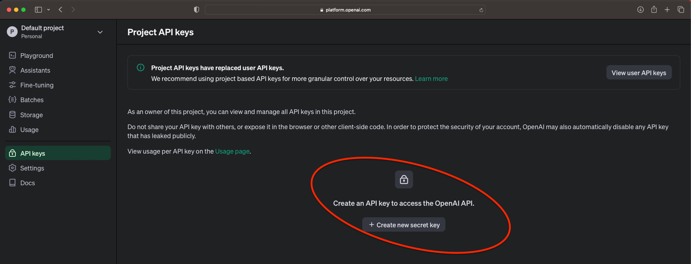
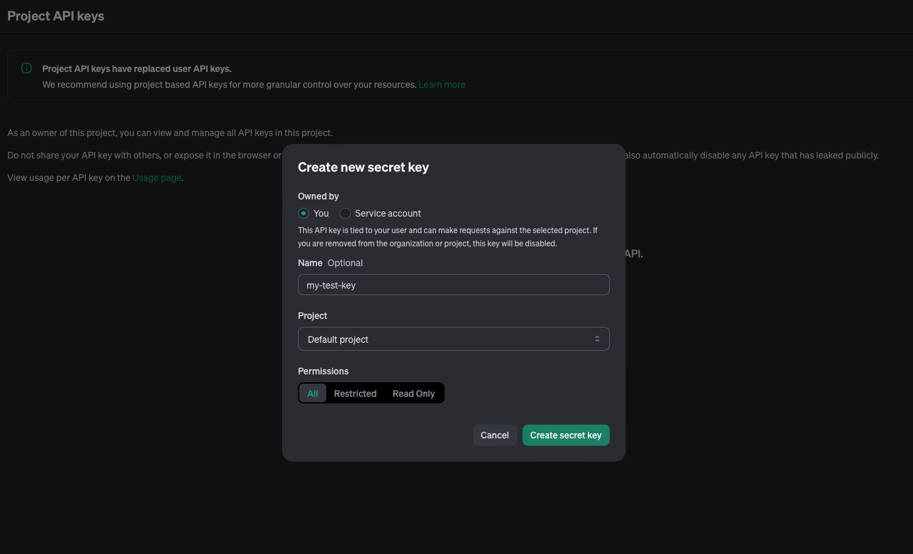
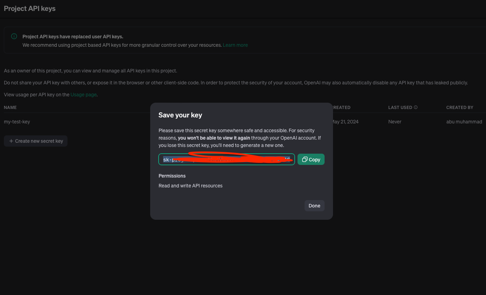
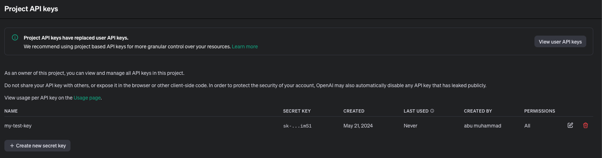
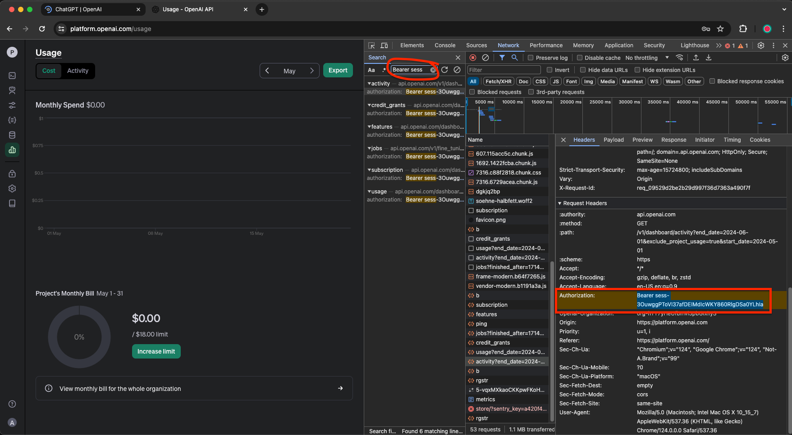

# 2024, May | Create an OpenAI API Key

&nbsp;

&nbsp;

Reference :  
- Docs | GTP for Work
  <pre>https://gptforwork.com/help/knowledge-base/create-openai-api-key</pre>

&nbsp;

Create an OpenAI API key to gain access to the ChatGPT API. This key allows OpenAI to track your usage and generate accurate billing.

<pre>https://platform.openai.com/api-keys</pre>

    

 

&nbsp;

    

 

&nbsp;

    

 

&nbsp;

    

 

&nbsp;

&nbsp;

---

&nbsp;

&nbsp;

## How to get the OpenAI Session Token?

1. Go to: https://platform.openai.com/usage

2. Open Chrome Developer Tools

3. Click the Network Tab

4. Click the Search Icon beside

5. Refresh Your Screen While On Network Tab

6. Search ‘sess-’ and click highlight

7. Copy the session from the right side 
   It will be in the request headers under `authorization`.

    

 

&nbsp;

---

&nbsp;

    

 

&nbsp;

---

&nbsp;

&nbsp;

&nbsp;