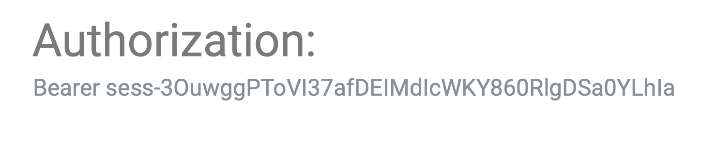

## Test : used OpenAI Session Token

    

 

&nbsp;

### Begin 
<pre>
    ❯ python3 -m venv .venv

    ❯ source .venv/bin/activate

    ❯ pip install openai==0.28
</pre>

&nbsp;

### Code
<pre>
    ❯ vim main.py

            import openai

            def chat_with_gpt(user_input):

                # API KEY "test-key" (created 17 Mat 2024) pawonebabah2019@gmail.com
                openai.api_key =""

                response = openai.Completion.create(
                    engine="gpt-3.5-turbo-instruct",
                    prompt=user_input,
                    max_tokens=150
                )

                assistant_response = response['choices'][0]['text']
                return assistant_response

            user_input = input("How may I help you? ")
            Ask_chatgpt = chat_with_gpt(user_input)
            print(f"Assistant: {Ask_chatgpt}")
</pre>

&nbsp;